# Software Architecture Specifications - Supa-Neighbour

## Table of Contents

- [Software Architecture Specifications - Supa-Neighbour](#software-architecture-specifications---supa-neighbour)
  - [Table of Contents](#table-of-contents)
  - [1. Introduction](#1-introduction)
  - [2. Architectural Requirements](#2-architectural-requirements)
    - [2.1 Architectural Pattern](#21-architectural-pattern)
      - [2.1.1 Reasons for Choosing This Architecture](#211-reasons-for-choosing-this-architecture)
  - [2.2 Architectural Diagram](#22-architectural-diagram)
    - [2.3 Constraints on the Architecture](#23-constraints-on-the-architecture)
    - [2.4 Design Patterns](#24-design-patterns)
      - [2.4.1 Singleton Pattern (Creational)](#241-singleton-pattern-creational)
      - [2.4.2 Factory Pattern (Creational)](#242-factory-pattern-creational)
      - [2.4.3 Repository Pattern (Structural)](#243-repository-pattern-structural)
      - [2.4.4 Observer Pattern (Behavioral)](#244-observer-pattern-behavioral)
      - [2.4.5 Dependency Injection Pattern (Structural)](#245-dependency-injection-pattern-structural)
  - [3. Technology Requirements](#3-technology-requirements)
  - [4. API Contract](#4-api-contract)
  - [5. Deployment Requirements](#5-deployment-requirements)
    - [Environment Parity](#environment-parity)
    - [Secrets Management](#secrets-management)
    - [Rollback Strategy](#rollback-strategy)
    - [Deployment Diagram](#deployment-diagram)
  - [6. Quality Requirements to Architectural Decisions Mapping](#6-quality-requirements-to-architectural-decisions-mapping)
    - [6.1 NFR Traceability Matrix](#61-nfr-traceability-matrix)
  - [6.2 NFR Testing](#62-nfr-testing)
    - [6.2.1 Reliability](#621-reliability)
    - [6.2.2 Availability](#622-availability)
    - [6.2.3 Maintainability](#623-maintainability)
    - [6.2.3 Usability](#623-usability)
      - [Task Completion Results](#task-completion-results)
      - [System Usability Scale (SUS) Results](#system-usability-scale-sus-results)
      - [Key Findings](#key-findings)

## 1. Introduction

This document covers all things related to the architecture and deployment of the system.

## 2. Architectural Requirements

### 2.1 Architectural Pattern

---

Supa-Neighbour employs a **Client-Server Architecture** with the following components:

a) **Frontend (Flutter)** - the mobile client used by residents and helpers to interact with the platform (post tasks, browse helpers, chat, view trust scores and gamification progress).

b) **Backend (Spring Boot)** - the central server, which internally follows a **Layered Architecture** (Controller → Service → Repository → DTO) to separate request handling, business logic, and data access.

c) **Communication** - the frontend and backend communicate via **REST APIs**, keeping the client and server decoupled and independently deployable.

d) **Database (Azure Database for PostgreSQL)** - a centralised database used for both read and write operations, acting as the single source of truth for tasks, users, ratings, and chat data.

e)  **Blob Storage** : Azure cloud object storage that holds all user-uploaded images, including profile photos, post and chat images, and task evidence photos.

---

#### 2.1.1 Reasons for Choosing This Architecture

---

a) **Separation of concerns.** Splitting the system into a client and a server keeps presentation, business logic, and data access cleanly isolated from one another.

b) **Multiple, independent clients need to hit the same backend (admin and user).** The platform supports two distinct kinds of clients over its lifetime:

- The **Flutter user app**, used by residents and helpers.
- The **admin web interface**, used for moderation, verification oversight, and platform management.

---

## 2.2 Architectural Diagram

Please refer to this for the Architectural Diagram: [Architectural Diagram](<Images/Architecture diagram  V4.drawio.png>)

### 2.3 Constraints on the Architecture

---

a) **Azure compatibility requirement.** All chosen technologies had to be compatible with, and provisionable within, the Azure ecosystem (App Service, Azure Database for PostgreSQL, Blob Storage, Key Vault, Container Registry), limiting technology choices to what integrates cleanly with Azure-native services.

b) **Security and compliance standards.**

- **POPIA compliance**: the system must protect personally identifiable information in line with South Africa's data protection law, driving decisions such as AES-256 column-level encryption for sensitive fields.
- **Verified-user access only:** the platform must ensure only authenticated, verified users can access the app, enforced through Firebase Authentication and the Admin SDK, rather than a custom-built authentication system.

c) **Mandatory cloud deployment target.** The application is required to be deployed to Azure specifically (rather than any general cloud provider), constraining infrastructure decisions to Azure's available services, deployment models (App Service, ACR-based CI/CD), and regional availability.

d) **Mandated authentication provider**: Firebase Authentication is fixed as the identity provider, meaning the backend cannot own credential storage and must integrate via the Admin SDK.

### 2.4 Design Patterns

Design patterns are reusable solutions to common software design problems at the code or component level. They improve flexibility, maintainability, and code reuse.

The SupaNeighbour system employs the following design patterns across both the frontend (Flutter/Dart) and backend (Spring Boot/Java):

#### 2.4.1 Singleton Pattern (Creational)

**Problem Solved:**
The application requires a single, globally accessible source of truth for the user's authentication session. Multiple instances would lead to inconsistent state and potential bugs.

**Where It's Used:**

- **File:** `frontend/lib/models/auth_session.dart`
- **Class:** `AuthSession`
- **Method:** `AuthSession.instance` (static getter)

**Implementation Details:**
The `AuthSession` class uses a private constructor and a static instance to ensure only one instance exists throughout the application lifecycle.

**Why This Pattern Was Chosen:**

- Ensures consistent authentication state across all screens
- Prevents duplicate instances that could cause state conflicts
- Simple and widely understood pattern

**Code Snippet:**

```dart
class AuthSession {
  static final AuthSession _instance = AuthSession._internal();
  factory AuthSession() => _instance;
  static AuthSession get instance => _instance;

  User? _currentUser;
  bool get isLoggedIn => _currentUser != null;

  void login(User user) {
    _currentUser = user;
  }

  void logout() {
    _currentUser = null;
  }
}
```

#### 2.4.2 Factory Pattern (Creational)

**Problem Solved:**
The application receives JSON data from the backend API and needs to convert it into Dart objects. The creation logic is complex and should be encapsulated in a single place.

**Where It's Used:**

- **File:** `frontend/lib/models/task_model.dart`
- **Class:** `Task`
- **Method:** `Task.fromJson()`
- **File:** `frontend/lib/models/user_model.dart`
- **Class:** `User`
- **Method:** `User.fromJson()`

**Why This Pattern Was Chosen:**

- Encapsulates complex object creation logic
- Makes the code more maintainable when the API contract changes
- Separates creation logic from the rest of the class
- Allows for validation and transformation during creation

**Code Snippet:**

```dart
class Task {
  factory Task.fromJson(Map<String, dynamic> json) {
    final DateTime startDate = json['startDate'] != null 
        ? DateTime.parse(json['startDate'] as String) 
        : DateTime.now();

    return Task(
      id: (json['taskId'] as int).toString(),
      title: _resolveCategoryName(json['taskTypeId'] as int?),
      category: _resolveCategoryName(json['taskTypeId'] as int?),
      date: startDate,
      time: TimeOfDay(hour: startDate.hour, minute: startDate.minute),
      xpReward: 0,
      instructions: json['adminReview'] as String? ?? 'No instructions provided',
      status: json['helperId'] != null ? 'in_progress' : 'pending',
      createdAt: startDate,
      createdBy: json['createdBy'] as String? ?? 'unknown',
      requesterName: json['requesterName'] as String?,
      helperId: json['helperId'] as String?,
      helperName: json['helperName'] as String?,
      completionNote: json['completionNote'] as String?,
      completionPhotos: json['completionPhotos'] != null
          ? List<String>.from(json['completionPhotos'] as List)
          : null,
    );
  }
}
```

#### 2.4.3 Repository Pattern (Structural)

**Problem Solved:**
The backend needs to separate data access logic from business logic. This makes the code more maintainable and allows for easier switching between data sources.

**Where It's Used:**

- **Files:** `backend/src/main/java/com/app/api/repositories/*Repository.java`
- **Examples:** `TaskRepository.java`, `UserRepository.java`, `RatingRepository.java`

**Implementation Details:**
Spring Data JPA repositories handle all database operations. Each repository interface extends `JpaRepository`, providing built-in CRUD operations and custom query methods.

**Why This Pattern Was Chosen:**

- Separates data access from business logic
- Makes testing easier (can mock repositories)
- Allows for switching data sources without changing business logic
- Provides a consistent API for data access
- Spring Data JPA reduces boilerplate code

**Code Snippet:**

```java
@Repository
public interface TaskRepository extends JpaRepository<Task, Integer> {
    List<Task> findByCreatedBy(String userId);
    List<Task> findByHelperId(String helperId);
    List<Task> findByStatus(String status);
}
```

#### 2.4.4 Observer Pattern (Behavioral)

**Problem Solved:**
The UI needs to react to changes in application state. When data changes, the UI should automatically rebuild to reflect the new state.

**Where It's Used:**

- **File:** Throughout the frontend
- **Library:** Riverpod (`ref.watch()`, `ref.read()`)
- **Examples:** `home_screen.dart`, `profile_screen.dart`, `my_tasks_screen.dart`

**Why This Pattern Was Chosen:**

- Decouples state management from the UI
- Automatically updates UI when state changes
- Makes testing easier (providers can be overridden)
- Prevents unnecessary rebuilds
- Clean, declarative code

**Code Snippet:**

```dart
final firebaseAuthProvider = Provider<FirebaseAuth>((ref) {
  return FirebaseAuth.instance;
});

class MyWidget extends ConsumerWidget {
  @override
  Widget build(BuildContext context, WidgetRef ref) {
    final auth = ref.watch(firebaseAuthProvider);
    // Widget automatically rebuilds when auth changes
    // ...
  }
}
```

#### 2.4.5 Dependency Injection Pattern (Structural)

**Problem Solved:**
Classes should not create their own dependencies. This makes the code more testable and flexible, as dependencies can be swapped without changing the class.

**Where It's Used:**

- **File:** `frontend/lib/providers/theme_mode_provider.dart`
- **Library:** Riverpod

**Why This Pattern Was Chosen:**

- Makes code highly testable (mocks can be injected)
- Reduces coupling between classes
- Follows the "inversion of control" principle
- Dependencies are explicit and visible
- Easy to swap implementations

**Code Snippet:**

```dart
final firebaseAuthProvider = Provider<FirebaseAuth>((ref) {
  return FirebaseAuth.instance;
});

// In tests, the provider can be overridden:
final testProvider = ProviderScope(
  overrides: [
    firebaseAuthProvider.overrideWithValue(mockAuth),
  ],
  child: const MaterialApp(home: MyScreen()),
);
```

These five design patterns work together to create a clean, maintainable, and testable codebase that supports current requirements and can easily accommodate future changes. The creational patterns (Singleton and Factory) manage object creation, structural patterns (Repository and Dependency Injection) organise code structure, and the behavioral pattern (Observer) handles reactive state updates in the UI.

## 3. Technology Requirements

**Flutter - Frontend (Mobile Application)**

- Single codebase targets both iOS and Android, saving development time for a small team on a fixed timeline
- Widget-based architecture supports the accessible, large-font, intuitive UI required by R6
- Built-in testing framework supports the unit/widget test coverage tracked under the Maintainability NFR

**Spring Boot + Docker - Backend**

- Mature ecosystem for building secure, RESTful, role-based APIs, supporting R5.2.2 (role-based access control for resident, helper, admin)
- Docker packaging decouples the backend from the host environment, ensuring consistent behaviour between WSL2 development and production
- Supports the automatic-restart recovery strategy described under the Reliability NFR

**Firebase - Authentication (Login & Registration)**

- Provides email verification, password strength enforcement, and account lockout out of the box
- Satisfies R1.1.1 (email verification) and R1.2.1 (password strength validation)
- Removes the need to build and maintain custom authentication/credential-storage logic, reducing security risk

**Azure Database for PostgreSQL (Flexible Server) - Database**

- Chosen over Cosmos DB because the data (users, tasks, ratings, trust scores) is inherently relational, with clear foreign-key relationships
- Provides automated backups with a seven-day retention period, supporting the Reliability NFR's recovery targets

**Azure Blob Storage - Media Storage**

- Stores all user-uploaded images, including task completion photo evidence and in-app chat photo updates.
- Configured with Locally Redundant Storage (LRS), keeping multiple copies of files within the Azure region
- Supports the Reliability NFR's protection against hardware failure

**Azure Container Registry (ACR)**

- Stores versioned Docker images produced by the CI/CD pipeline before deployment
- Integrates natively with GitHub Actions and Azure App Service, allowing a merged change to move from build to deployment without manual intervention
- Supports the 2-hour deployability target in the Maintainability NFR

**Azure App Service (Web App)**

- Hosts the live backend container on a fully managed platform with a documented uptime SLA
- Built-in support for restart policies
- Native integration with Key Vault (secrets) and Application Insights (monitoring), supporting the Reliability and Availability NFRs

**Azure AI Foundry (gpt-4.1-mini) - Vision AI Task Verification**

- Provides the pre-trained vision model that compares task reference and completion photos, giving AI-based verification without training or hosting a custom model
- The model is deployed and managed through Azure AI Foundry, which keeps model deployment, access control and monitoring on the same Azure platform as the rest of the system
- Built-in content filtering reduces the risk of misuse compared with an unmanaged third-party API
- Supports the Vision AI wow-factor requirement while keeping scope realistic: a single hosted model call inside the existing task-completion flow

## 4. API Contract

Please follow the following link to the API Contract: [API Contract](<../Demo 4 Files/API_Service_Contract.md>)

## 5. Deployment Requirements

### Environment Parity

This project distinguishes between two environments:

- **Development (local):** configured via `application.yml`, connects to a local Postgres instance for development/testing without touching cloud resources.
- **Production (Azure):** configured via `application-azure.yml`, activated by setting `SPRING_PROFILES_ACTIVE=azure`. Connects to Azure Database for PostgreSQL Flexible Server and Azure Blob Storage.
  A separate staging environment was scoped out of this project by agreement with the course requirement owner, due to constraints of the free-tier Azure resources available to the team.

The `main` branch deploys automatically to the production environment via GitHub Actions (see `.github/workflows/backend.yml`).

### Secrets Management

- **GitHub Secrets:** used for Azure-related credentials needed during CI/CD, such as the username and password required to push the Docker image to Azure Container Registry.
- **Azure Key Vault:** used for backend runtime secrets, such as the database password, keeping them out of source control and environment config files.

### Rollback Strategy

- **Backend:** Every image pushed to Azure Container Registry is tagged uniquely by branch name and commit SHA, so no previous version is ever overwritten. In the event of a failed deployment, rollback is performed by re-pointing the Azure Web App's container configuration to the last known-good image tag and restarting the app.
- **Frontend (static pages):** Deployments are tied to Git commits via GitHub Actions. Rollback is performed by checking out the last known-good commit, rebuilding, and redeploying via the Static Web Apps CLI.

### Deployment Diagram

Please refer to this for the Deployment Diagram: [Deployment Diagram](Images/DeplymentDiagram_v3.drawio.svg)

## 6. Quality Requirements to Architectural Decisions Mapping

| Quality Requirement                                                               | Architectural Decision                                                              | Rationale                                                                                                                  |
| --------------------------------------------------------------------------------- | ----------------------------------------------------------------------------------- | -------------------------------------------------------------------------------------------------------------------------- |
| **Reliability** (99.9% uptime, recover from critical failures within 5 min) | Docker container with automatic restart policy on failure                           | Container orchestration detects crashed processes and restarts them without manual intervention, keeping recovery time low |
|                                                                                   | Azure Database for PostgreSQL with automated backups (7-day retention)              | Data loss from a critical failure is bounded and recoverable - restore point available within the retention window         |
|                                                                                   | Azure Blob Storage with Locally Redundant Storage (LRS)                             | Media files survive single-hardware-node failures via automatic in-region replication                                      |
| **Maintainability** (deployable within 2 hrs, 80% test coverage)            | CI/CD pipeline: GitHub Actions → Azure Container Registry → App Service           | Automates build/test/deploy so a merged change requires no manual environment setup - collapses deploy lead time           |
|                                                                                   | Environment-specific config (`application-azure.yml`) separated from local config | Prevents environment drift/manual reconfiguration at deploy time, a common source of deploy delay                          |
|                                                                                   | Azure Key Vault for runtime secrets, GitHub Secrets for CI/CD-time secrets          | Removes manual credential handling as a deployment bottleneck                                                              |
|                                                                                   | SonarQube continuous coverage tracking                                              | Coverage regressions are caught per-scan rather than only at release, keeping the 80% floor enforceable over time          |
|                                                                                   | Layered Controller → Service → Repository → DTO pattern                          | Isolates change impact to a single layer, reducing the blast radius (and testing effort) of new features/fixes             |
| **Availability** (24/7, ≤2 hrs/month scheduled maintenance)                | Azure App Service (PaaS) for backend hosting                                        | Managed platform with built-in uptime SLA, patching, and health monitoring, rather than self-managed VM uptime             |
|                                                                                   | Azure Postgres Flexible Server (managed DB service)                                 | Managed service uptime SLA + built-in failover handling, removing single-point-of-failure risk from self-hosted DB         |
|                                                                                   | Stateless backend design (no server-side session state)                             | Any instance can serve any request, so scheduled maintenance or instance restarts don't require app-wide downtime          |

### 6.1 NFR Traceability Matrix

| ID    | Quantified requirement                                                                                                                                    | Tactic in SAS                                                                                                                                                                                                                | Test / tool                                                                                                                    | Target / actual                                                                        |
| ----- | --------------------------------------------------------------------------------------------------------------------------------------------------------- | ---------------------------------------------------------------------------------------------------------------------------------------------------------------------------------------------------------------------------- | ------------------------------------------------------------------------------------------------------------------------------ | -------------------------------------------------------------------------------------- |
| QR-08 | New features/fixes deployable within 2 hours of merge to main                                                                                             | Automate deployment (GitHub Actions → ACR → Azure App Service on merge)                                                                                                                                                    | GitHub Actions run duration log                                                                                                | <2h / minutes (pipeline currently completes in minutes)                                |
| QR-09 | ≥80% automated test coverage on backend codebase                                                                                                         | JaCoCo + SonarQube coverage gate, blocking merge on failure                                                                                                                                                                  | JaCoCo / SonarQube                                                                                                             | 80% coverage                                                                           |
| QR-10 | Authenticated requests with an invalid/expired token return 401, not 500 or a hang                                                                        | Centralized auth validation at the request boundary (FirebaseAuthenticationFilter)                                                                                                                                           | curl (manual,`Bearer expired_token`)                                                                                         | 401 only / 401 confirmed (pass)                                                        |
| QR-11 | DB-backed endpoints fail within ~5s when the database is unreachable, not 30s+                                                                            | HikariCP`connection-timeout` configuration                                                                                                                                                                                 | `docker stop` DB container + `curl` timing                                                                                 | <5s / TBD (config presence in`application-azure.yml` unverified; retest pending)     |
| QR-12 | Task creation does not silently fail to notify helpers when the matching service errors                                                                   | Event-driven matching via`ApplicationEventPublisher` + `@TransactionalEventListener(AFTER_COMMIT)` (planned refactor, same pattern as FCM)                                                                               | Simulated 500 on`/match` endpoint                                                                                            | 0 stranded tasks / currently fails — fire-and-forget gap confirmed, GitHub issue open |
| QR-13 | System available 24/7, excluding ≤2 hours/month of scheduled maintenance                                                                                 | `/health` endpoint + external uptime monitoring                                                                                                                                                                            | UptimeRobot                                                                                                                    | ≥99.9%                                                                                |
| QR-14 | A new user should be able to complete core tasks within 5 minutes of first using the system, with at least 85% user satisfaction during usability testing | User-centered design approach; consistent UI patterns; intuitive navigation with bottom navigation bar and collapsible sidebar; Help Menu; WCAG 2.1 AA compliant (14pt body text, 44pt touch targets, high-contrast colours) | Moderated usability testing with 5-8 participants; Timed observation of core tasks; System Usability Scale (SUS) questionnaire | <5 min / Avg 1m 46s; SUS > 70 / 83.5                                                   |

## 6.2 NFR Testing

### 6.2.1 Reliability

UptimeRobot's 30-day monitoring shows 99.853% uptime (7 incidents, 1h 3m 44s downtime), close to but not fully meeting the 99.9% target — the gap is roughly 20 minutes over the month. Recovery from critical failures is supported architecturally by the Docker container's automatic-restart policy


### 6.2.2 Availability

The same 30-day window shows total downtime of 1h 3m 44s, well within the ≤2-hour/month allowance for the 24/7 availability requirement. No maintenance windows have been scheduled to date, so this reflects unplanned downtime only.


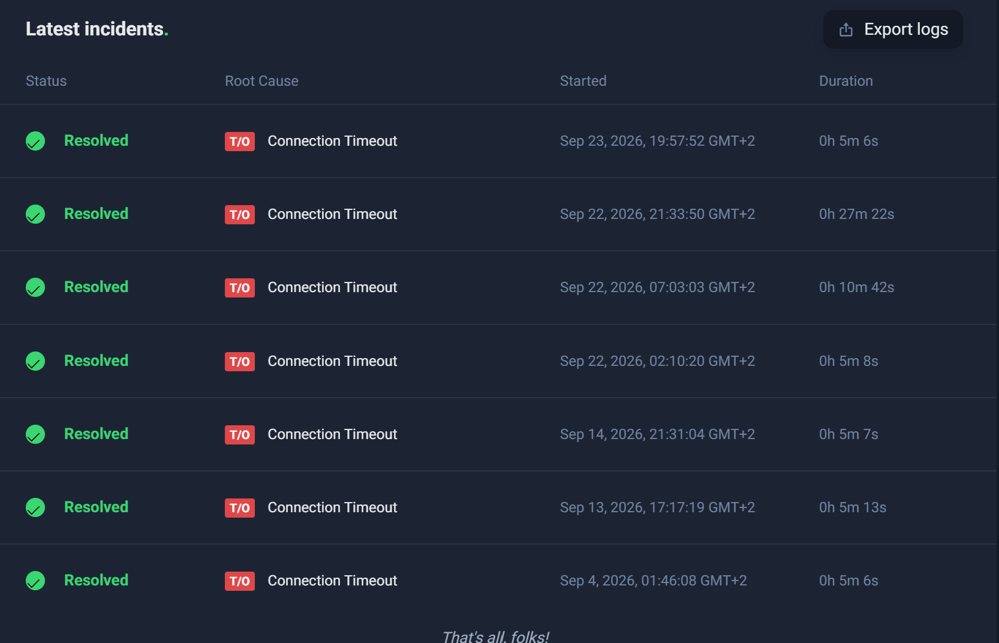

### 6.2.3 Maintainability

The screenshots below show CI/CD pipeline deployment times, each staying within the 2-hour deployability target set out in the Maintainability NFR.

**Backend deployment**

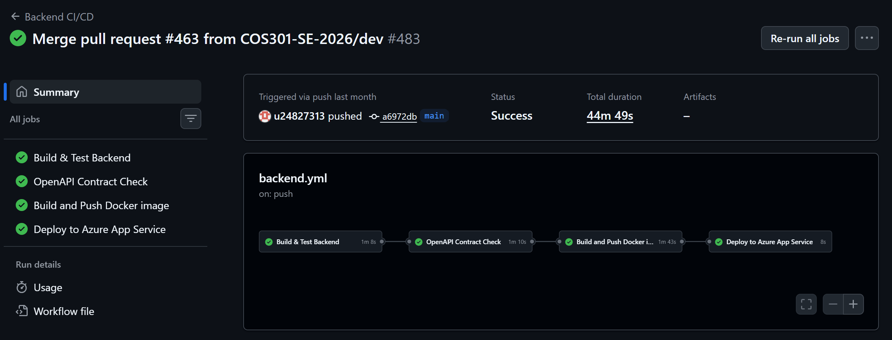

**Frontend Deployment**

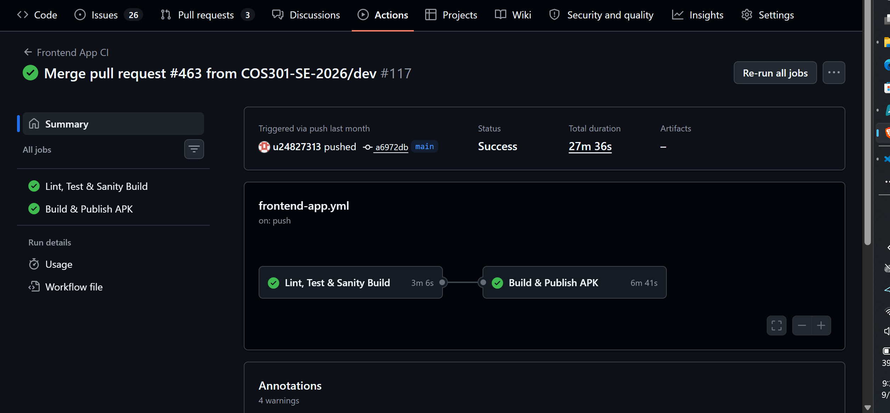

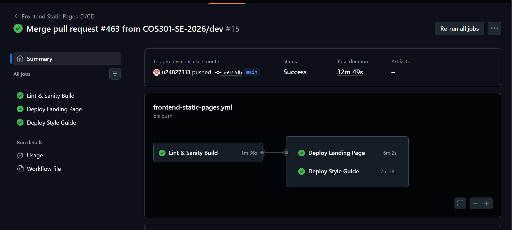

### 6.2.3 Usability

A moderated usability test was conducted with 5 participants to evaluate the mobile application's usability. Participants were asked to complete 6 core tasks while being timed and observed. Each task had a defined target completion time, and outcomes were recorded as either completed successfully, completed with assistance, or failed/abandoned.

#### Task Completion Results

| Task                              | Target      | Completed Successfully | Completed w/ Assistance | Failed / Abandoned | Average Time | Status          |
| --------------------------------- | ----------- | ---------------------- | ----------------------- | ------------------ | ------------ | --------------- |
| T1: Create Account                | ≤ 2 min     | 60% (3/5)              | 40% (2/5)               | 0% (0/5)           | 1:48         | Pass w/ support |
| T2: Profile Setup                 | ≤ 1.5 min   | 80% (4/5)              | 20% (1/5)               | 0% (0/5)           | 0:44         | Pass            |
| T3: Post a Task                   | ≤ 1.5 min   | 100% (5/5)             | 0% (0/5)                | 0% (0/5)           | 0:49         | Pass            |
| T4: Browse & Accept Task          | ≤ 1.5 min   | 60% (3/5)              | 40% (2/5)               | 0% (0/5)           | 0:47         | Pass w/ support |
| T5: Navigate to Chat              | ≤ 30 sec    | 100% (5/5)             | 0% (0/5)                | 0% (0/5)           | 0:13         | Pass            |
| T6: Navigate to Bulletin & Post   | ≤ 120 sec   | 80% (4/5)              | 20% (1/5)               | 0% (0/5)           | 0:26         | Pass            |
| **Overall**                       | —           | **80% (24/30)**        | **20% (6/30)**          | **0% (0/30)**      | **0:47 avg** | **Pass**        |

#### Key Findings

**Strengths:**

- T3 (Post a Task) and T5 (Navigate to Chat) were completed successfully by all 5 participants without assistance. Users described the flow as "intuitive and straight to the point."
- The chat icon placement within the Tasks section was easily discoverable, with all users locating it within 30 seconds.
- The bulletin board tab heading and its location within the chat screen were described as clear and logically placed.

**Areas for Improvement:**

- T1 (Create Account) required assistance for 2 of 5 participants, and one user noted the flow felt "a bit too long." Consider simplifying the account creation steps.
- T2 (Profile Setup) showed a wide variance in completion time (11s to 2m), suggesting inconsistent user confidence. Additional inline guidance may help.
- T4 (Browse & Accept Task) needed assistance for 2 of 5 participants, with one noting they "had to understand quite a bit." Improving the task acceptance UI could reduce friction.
- T6 (Navigate to Bulletin & Post) required assistance for 1 of 5 participants, though the tab was generally well received.

#### Summary

All 6 tasks were completed by all participants, with no failures or abandonments. 80% of task attempts were completed independently, and the remaining 20% required minimal assistance. Overall, the application demonstrated strong usability across core flows, with the account creation, profile setup, browse/accept, and bulletin posting flows identified as areas for further refinement.

 


 


 


 


 


 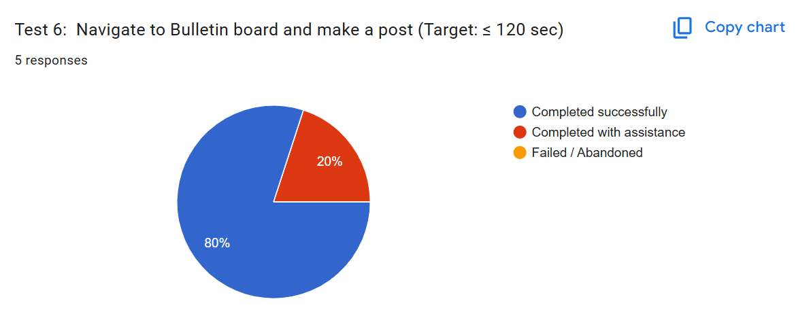

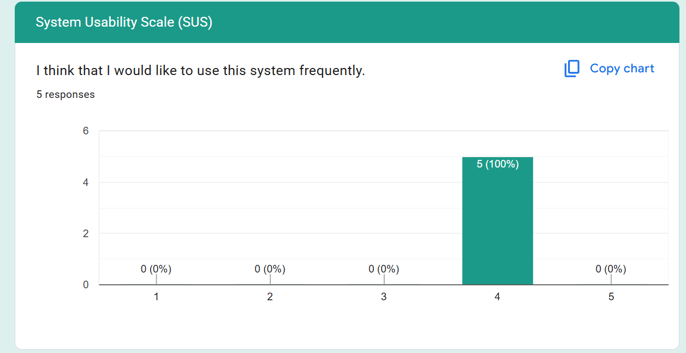
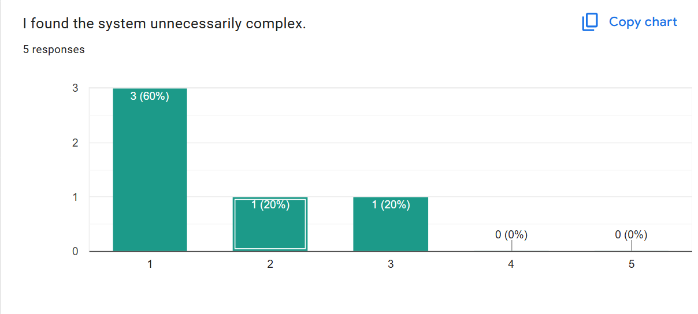
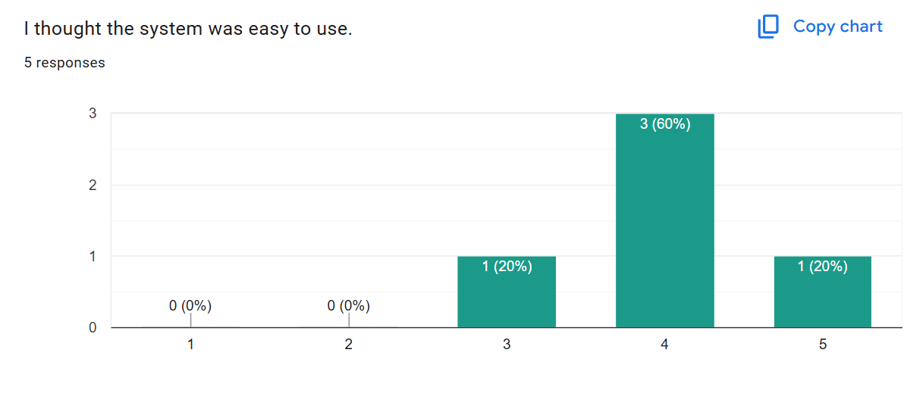
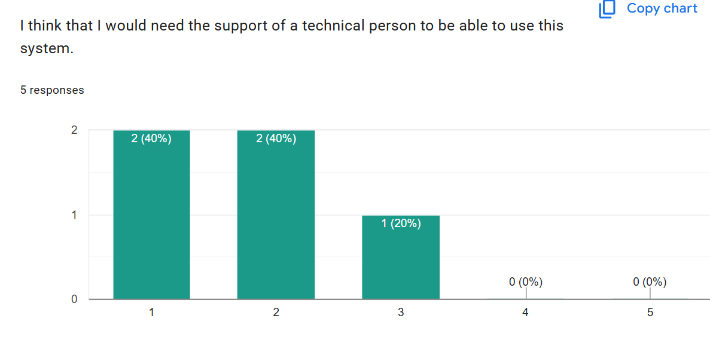
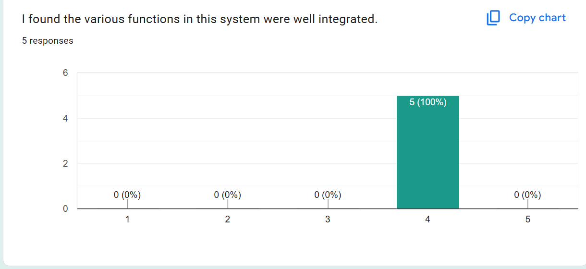
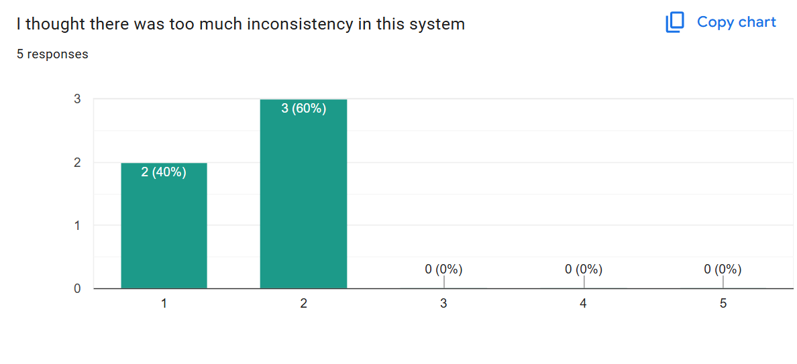
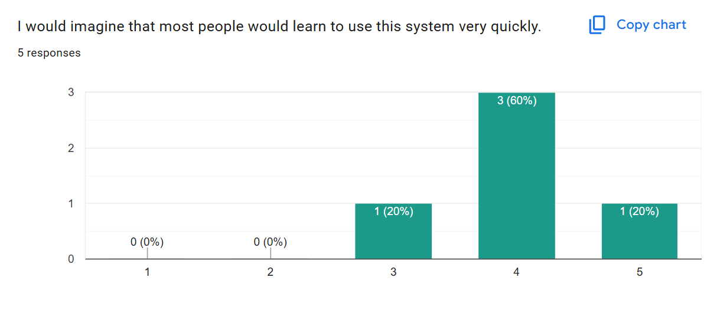
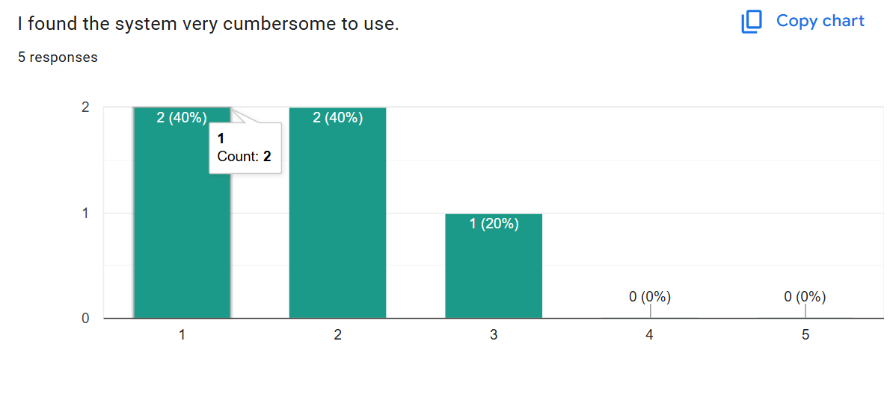
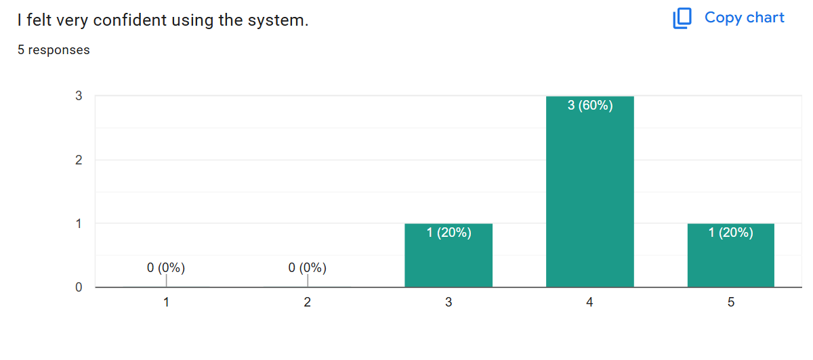
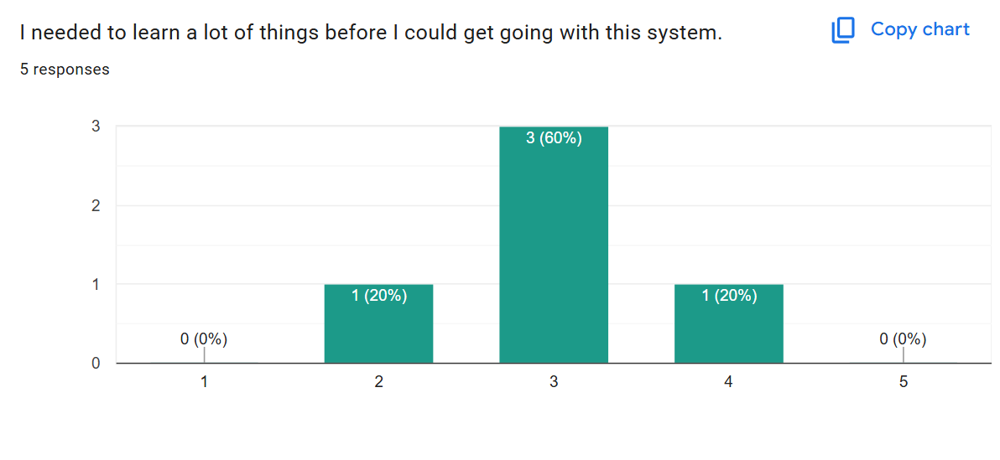